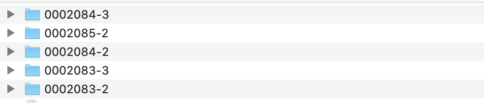
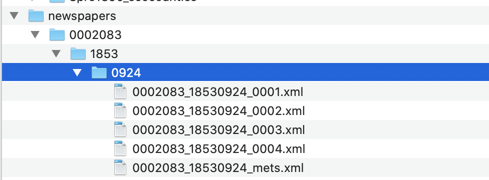

# Download and Unzip Newspaper Files Using R

## Download a set of newspaper files from the British Library's open repository
Newspaper data is available on the British Library's open repository, and the first thing to do is to download and extract the data so that it can be worked on in the rest of the handbook. 

First, download some years you're interested in from the Repository. The titles are available on the research repository here: https://bl.iro.bl.uk/collection/353c908d-b495-4413-b047-87236d2573e3, and more will be added with time. The repository is divided into _collections_ and _datasets._ The British Library newspapers collection contains a series of datasets, each of which contains a number of files. Each of the _files_ is a zip file containing all the METS/ALTO .xml for a single year of that title. 

For this tutorial, I've downloaded all the files for the Northern Daily Times and its linked titles, which are all available [here](https://doi.org/10.23636/1163). All these titles have a doi which makes them nicely suitable for reproducible code. 

From that link: "The Liverpool-based Northern Daily Times (1853-1961, with two changes of title) was the first provincial daily newspaper in England to enjoy a sustained run."

It will make a nice case study for some of the techniques in the tutorials. 


## Folder structure

Each file will have a filename like this:

BLNewspapers_TheSun_0002194_1850.zip

To break it down in parts:

BLNewspapers - this identifies the file as coming from the British Library

TheSun - this is the title of the newspaper, as found on the Library's catalogue.

0002194 - This is the _NLP_, a unique code given to each title. This code is  also found on the [Title-level list](https://doi.org/10.23636/1136), in case you want to link the titles from the repository to that dataset.

1850 - The year.

## Contruct a Corpus

Construct a 'corpus' of newspapers, using whatever criteria you see fit. Perhaps you're interested in a longitudinal study, and would like to download a small sample of years spread out over the century, or maybe you'd like to look at all the issues in a single newspaper, or perhaps all of a single year across a range of titles.

Once you've downloaded your corpus, put the unextracted zip files in a folder called 'newspapers', within the working directory for this R project. If you're using windows, you can use the method below to bulk extract the files. On mac, the files will unzip automatically, but they won't merge: the OS will duplicate the folder with a sequential number after it - so you might need to move years from these extra folders into the first NLP folder.

For example: if you download all the zip files from the link above, you'll have some extra folders named like the below:


You'll need to move the year folders within these to the folders named 0002083, and so forth.

## Bulk extract the files using unzip() and a for() loop

R can be used to unzip the files in bulk, which is particularly useful if you have downloaded a large number of files. It's very simple, there's just two steps. This is useful if you're using windows and have a large number of files to unzip.

First, use ```list.files()``` to create a vector, called ```zipfile``` containing the full file paths to all the zip files in the 'newspapers' folder you've just created.

```{r eval=FALSE}
zipfiles = list.files("newspapers/", full.names = TRUE)
zipfiles
```

Now, use this in a loop with ```unzip()```. 

Loops in R are very useful for automating simple tasks. The below takes each file named in the 'zipfiles' vector, and unzips it. 

```{r eval=FALSE}
for(file in zipfiles){
  
  unzip(file)
  
}
```

Once this is done, you'll have a new (or several new) folders in the directory that you're working in (not the newspapers directory). These are named using the NLP, so they should look like this in your project directory:



To tidy up, put these _back_ into the newspapers folder, so you have the following:

Project folder-> newspapers ->```group of NLP folders```

The next step is to extract the full text and put it into .csv files
